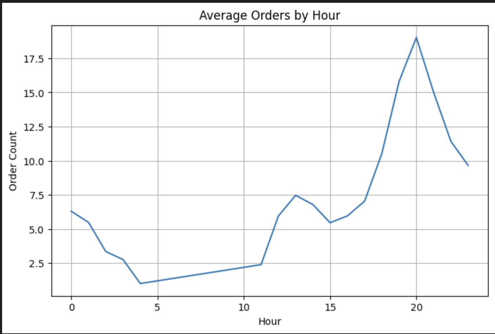
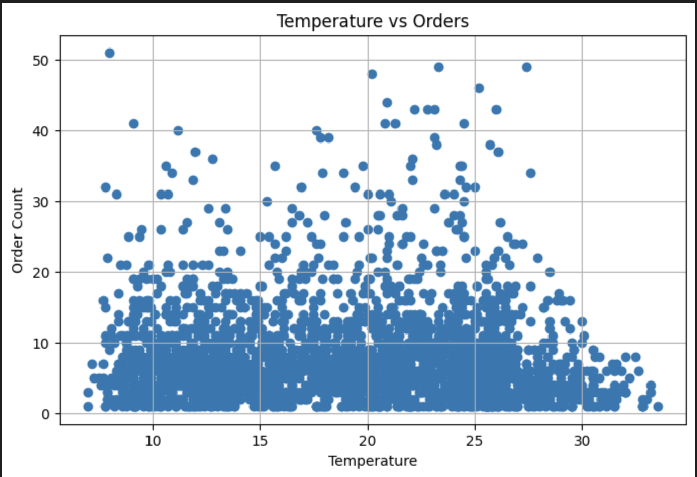

# DSA210 Final Report

## Analying the Impact of Time, Weather, and Weekly Patterns on Food Delivery Demand

### Egemen Yis

Sabancı University – DSA210 Introduction to Data Science

---

# Motivation

Food delivery services have become an essential part of daily life, especially in large urban environments where convenience and speed strongly influence consumer behavior. However, food delivery demand is not constant throughout the day and may change depending on several environmental and behavioral factors.

As someone interested in the intersection of data science, consumer behavior, and operational systems, I wanted to explore the underlying patterns that shape food delivery demand. In particular, I was interested in understanding whether customer ordering behavior is primarily driven by time-based routines such as lunch and dinner hours, or whether external conditions such as weather also have a measurable effect on demand.

This project investigates how hourly food delivery demand changes according to:

* Time of day
* Temperature
* Weather conditions

The motivation behind the project is to better understand customer demand behavior and identify which variables are the strongest predictors of order volume. Such insights may help delivery platforms optimize workforce allocation, operational planning, and demand forecasting systems.

The project combines exploratory data analysis, statistical hypothesis testing, and machine learning techniques to analyze both linear and non-linear relationships between variables.

---

# Data Sources and Feature Engineering

## Food Delivery Dataset

The primary dataset used in this project is the “Food Delivery Order History Data” dataset obtained from Kaggle. The dataset contains approximately 21,000 order records and includes timestamp-based order information.

The dataset provides:

* Order timestamps
* Order-related attributes
* Delivery-related information

The timestamp information was particularly important because it enabled the extraction of time-based features such as:

* Hour of the day
* Day of the week
* Weekend indicator

These variables formed the foundation of the demand analysis.

---

## Weather Dataset

To enrich the analysis, hourly historical weather data for the Delhi NCR region was collected using the Open-Meteo Historical Weather API.

The weather dataset includes:

* Temperature
* Precipitation

The weather observations were aligned with the order timestamps at the hourly level to create a unified dataset.

---

## Data Preparation

Several preprocessing and feature engineering steps were applied before analysis:

* Converted timestamp columns into datetime format
* Rounded timestamps to hourly intervals
* Aggregated order data into hourly order counts
* Merged weather and order datasets based on hourly timestamps
* Removed missing and inconsistent observations where necessary

The resulting merged dataset enabled the simultaneous analysis of temporal and environmental effects on delivery demand.

---

# Exploratory Data Analysis (EDA)

Exploratory Data Analysis was conducted to identify initial patterns and relationships within the dataset before applying statistical methods.

## General Dataset Overview

The first stage of the EDA focused on:

* Dataset dimensions
* Missing value analysis
* Summary statistics
* Distribution of numerical variables

This step helped ensure data consistency and provided a general understanding of the dataset structure.

---

## Time-Based Demand Patterns

One of the strongest patterns observed in the dataset was the effect of time on order volume.

### Orders by Hour

Hourly order counts showed clear peak periods throughout the day. Demand increased significantly during common meal hours, particularly around lunch and dinner times.

**Figure 1. Hourly food delivery demand distribution**

The figure demonstrates that order volume reaches its highest levels during lunch and dinner periods. This suggests that customer ordering behavior is strongly influenced by daily routines and meal schedules.

---

## Weather Relationships

The relationship between weather conditions and order demand was also explored visually.

### Temperature vs Orders

Temperature showed a weak-to-moderate relationship with demand. Certain temperature ranges appeared to correspond with slightly higher order volumes, although the relationship was not as strong as time-based effects.

**Figure 2. Temperature and order count relationship**

The figure indicates that temperature may have some influence on food delivery demand. However, compared to time-related variables, the relationship appears relatively limited.

---

# Hypothesis Testing

To statistically validate the observations identified during the EDA phase, several hypothesis tests were conducted.

---

## Hypothesis 1 – Temperature and Order Volume

### Hypothesis

* **Null Hypothesis ($H_0$):** Temperature has no statistically significant relationship with food delivery demand.
* **Alternative Hypothesis ($H_1$):** Temperature significantly affects food delivery demand.

### Method

Pearson Correlation analysis was applied between temperature and hourly order counts.

### Result

The analysis revealed a weak relationship between temperature and demand. Although some correlation existed, the effect size was relatively limited compared to time-related variables.

This suggests that temperature may influence customer behavior to some extent, but it is not the dominant driver of demand.

---

## Hypothesis 2 – Precipitation and Order Volume

### Hypothesis

* **Null Hypothesis ($H_0$):** Precipitation has no statistically significant relationship with order demand.
* **Alternative Hypothesis ($H_1$):** Precipitation significantly affects order demand.

### Method

Pearson Correlation analysis was conducted between precipitation levels and hourly order counts.

### Result

The statistical relationship between precipitation and order demand was weak and less consistent than expected.

This indicates that rainfall alone may not strongly determine customer ordering behavior within the observed dataset.

---

## Hypothesis 3 – Weekday vs Weekend Demand

### Hypothesis

* **Null Hypothesis ($H_0$):** There is no significant difference between weekday and weekend food delivery demand.
* **Alternative Hypothesis ($H_1$):** Weekend and weekday demand levels differ significantly.

### Method

Welch’s T-Test was used to compare average hourly demand between weekdays and weekends.

### Result

The analysis showed noticeable behavioral differences between weekdays and weekends, supporting the idea that weekly routines influence food delivery demand patterns.

---

## Hypothesis 4 – Peak vs Non-Peak Hours

### Hypothesis

* **Null Hypothesis ($H_0$):** Peak and non-peak hours have equal average order demand.
* **Alternative Hypothesis ($H_1$):** Peak-hour demand is significantly different from non-peak demand.

### Method

Welch’s T-Test was conducted between peak-hour and non-peak-hour order counts.

### Result

The results strongly supported the existence of peak-demand periods. Meal-time hours generated substantially higher order volumes compared to other periods of the day.

This was one of the strongest findings of the project.

---

# Machine Learning Models

The final stage of the project focused on predicting hourly food delivery demand using machine learning methods.

Because the target variable is numerical order count, the problem was approached as a regression task.

---

# Features Used

The following features were used for prediction:

* Hour of the day
* Day of week
* Weekend indicator
* Temperature
* Precipitation

These variables were selected based on both EDA observations and hypothesis testing results.

---

# Linear Regression

Linear Regression was used as the baseline model.

## Purpose

The model aimed to measure the direct linear relationship between environmental and time-related variables and order demand.

## Observations

Linear Regression captured the overall trend of the data reasonably well but struggled to model sudden demand spikes occurring during peak hours.

This suggests that food delivery demand is not entirely linear in nature.

---

# Random Forest Regressor

To better capture non-linear demand behavior, a Random Forest Regressor model was implemented.

## Advantages

Random Forest was selected because:

* It captures non-linear relationships effectively
* It handles interaction effects between variables
* It is robust against noisy observations

## Results

The Random Forest model achieved:

* Lower RMSE
* Higher R² scores
* Better prediction accuracy compared to Linear Regression

The model was particularly successful in capturing sudden increases during peak meal hours.

This indicates that food delivery demand contains non-linear behavioral patterns that are better modeled using tree-based algorithms.

---

# Model Evaluation

The models were evaluated using:

* Mean Absolute Error (MAE)
* Root Mean Squared Error (RMSE)
* R² Score

The evaluation results confirmed that time-based variables are the strongest predictors of food delivery demand.

In particular:

* Hour of day was the most influential variable
* Weekend effects also contributed significantly
* Weather variables showed smaller predictive power

---

# Key Findings

The project produced several important findings:

* Food delivery demand follows strong daily behavioral patterns
* Peak-hour effects are highly significant
* Time-related variables are stronger predictors than weather variables
* Temperature has a limited but noticeable influence on demand
* Precipitation does not show a strong statistical relationship with order volume
* Random Forest models outperform linear models for demand prediction

Overall, customer behavior appears to be primarily driven by routine-based consumption patterns rather than environmental conditions.

---

# Limitations

Although the project produced meaningful results, several limitations should be acknowledged.

## Geographic Limitation

The dataset is limited to the Delhi NCR region. Therefore, the findings may not generalize to other geographic areas with different climates or consumer behaviors.

---

## Limited Weather Variables

The analysis only included temperature and precipitation. Other environmental variables such as humidity, wind speed, or extreme weather conditions may also influence delivery demand.

---

## Time Granularity

The analysis was conducted at the hourly level. More detailed minute-level data could potentially capture short-term demand fluctuations more accurately.

---

## External Behavioral Factors

The dataset does not include additional variables such as:

* Promotional campaigns
* Holidays
* Major public events
* Pricing changes

These factors may also significantly influence food delivery demand.

---

# Conclusion

This project analyzed how food delivery demand changes according to time-based and weather-related factors using statistical analysis and machine learning techniques.

The results demonstrated that food delivery demand is strongly associated with behavioral routines such as meal hours and daily activity patterns. While weather conditions showed some influence, their effects were considerably weaker than temporal variables.

Machine learning models further confirmed that demand prediction benefits from non-linear modeling approaches. In particular, Random Forest outperformed Linear Regression by better capturing peak-demand behavior.

Overall, the project highlights the importance of time-driven behavioral patterns in food delivery systems and demonstrates how data science methods can be used to better understand and predict customer demand.

---

# AI Usage

AI tools were used throughout the project for:

* Debugging and improving Python code
* Structuring notebook organization
* Improving explanation clarity
* Assisting with report structure and wording

All analysis steps, interpretations, model decisions, and conclusions were independently reviewed and validated by the author.
